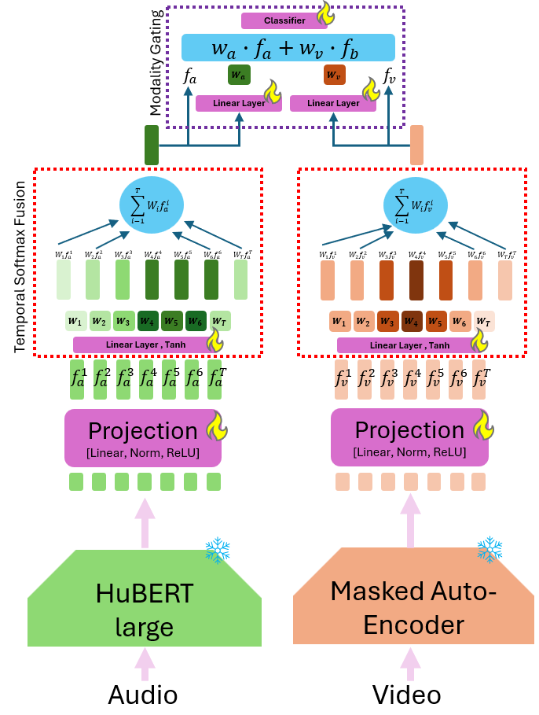

# MTLLFM: Multimodal-Temporal Laughter Localization

**UR-FUNNY-Temporal and SMILE-Temporal Benchmarks with an Adaptive Multimodal Fusion Model**

This repository releases the **temporal laughter annotations** (UR-FUNNY-Temporal and
SMILE-Temporal) and reference code to **train and run our model** for fine-grained
temporal localization of laughter in multimodal video.

📄 **Paper:** https://arxiv.org/pdf/2605.25409

<p align="center">
  
</p>

Frozen HuBERT (audio) and MAE (vision) encoders extract features that are projected to a
shared hidden space. **Temporal Softmax Fusion** independently pools each modality by
learning an attention distribution over timesteps, and **Adaptive Modality Gating**
produces complementary weights to fuse the pooled representations. A final classifier
outputs the binary laughter prediction, while the learned attention distributions provide
post-hoc temporal localization — all learned from **clip-level labels only**.

---

## Highlights

- **Weakly-supervised temporal localization**: precise onset/offset prediction trained
  without frame-level labels.
- **Lightweight**: frozen encoders + a small fusion head; `O(T)` temporal pooling instead
  of `O(T²)` cross-attention.
- **Two new benchmarks**: temporally-refined laughter annotations extending UR-FUNNY and
  SMILE, with speaker/audience origin, modality dominance, and intensity metadata.

---

## Repository layout

```
.
├── annotations/                  # released temporal laughter annotations (JSON)
│   ├── temporal_ur_funny.json
│   └── temporal_smile.json
├── assets/
│   └── architecture.png
├── data/                         # you populate this with media you obtain (see below)
│   ├── ur_funny/videos/
│   └── smile/videos/
├── src/
│   ├── model.py                  # MTLLFM model (AudioVisionSoftmaxPool)
│   ├── localize.py               # attention → temporal interval
│   ├── losses.py                 # Focal Loss
│   ├── dataset.py                # reads annotations + cached features
│   ├── extract_features.py       # HuBERT (audio) + MAE (vision) feature extraction
│   ├── train.py                  # trains MTLLFM from weak clip-level labels
│   └── run_inference.py          # runs OUR model and reports metrics
├── weights/                      # your trained checkpoints are written here
├── requirements.txt
└── README.md
```

---

## The datasets

We provide **fine-grained temporal laughter annotations** for the UR-FUNNY and SMILE
benchmarks. Unlike the original clip-level humor labels, each laughter event is annotated
with frame-accurate onset/offset boundaries plus rich metadata.

### Annotation format

Each file is a JSON list of records:

```json
{
  "name": "408.mp4",
  "split": "test",
  "laughter_events": [
    {
      "start": 7.852,
      "end": 9.165,
      "intensity": "Chuckle",
      "source": "Acoustic",
      "speaker": "Audience"
    }
  ]
}
```

| Field        | Description |
|--------------|-------------|
| `name`       | Clip identifier; matches the media filename you place under `data/<dataset>/videos/`. |
| `split`      | `train` / `dev` / `test`. |
| `start`,`end`| Laughter onset/offset in **seconds**, relative to the clip. |
| `intensity`  | `Chuckle` (subtle) or `Laughter` (pronounced). |
| `source`     | Dominant cue: `Acoustic`, `Visual`, or `Both`. |
| `speaker`    | `Speaker` (on-screen subject) or `Audience` (off-screen / secondary). |

Clips with no `laughter_events` are negatives (no laughter). Full corpus statistics
(durations, modality-dominance and speaker/audience distributions for all 10,166
UR-FUNNY and 887 SMILE videos) are reported in Table 1 of the paper.

---

## Data & Copyright

**We do not own and do not distribute the underlying audio/visual media.** The video
content belongs to the original **UR-FUNNY** and **SMILE** datasets and their respective
rights holders. This repository publishes **only our temporal annotations** (timestamps
and event metadata) for non-commercial research use. All rights to the original recordings
remain with their owners; no media is redistributed here in any form.

To reproduce our results you must obtain the source media yourself, directly from the
official UR-FUNNY and SMILE dataset releases, under their original terms and licenses:

- **UR-FUNNY** — follow the data-access instructions in the official UR-FUNNY repository.
- **SMILE** — follow the data-access instructions in the official SMILE repository.

After acquiring each clip, place it under the matching folder and name it to match the
`name` field in the annotation JSON:

```
data/ur_funny/videos/<name>     e.g. data/ur_funny/videos/4466906_254.51_259.51.mp4
data/smile/videos/<name>        e.g. data/smile/videos/408.mp4
```

You only need the subset of clips you wish to evaluate — the pipeline automatically skips
any annotated clip whose media (and features) are not present locally.

---

## Setup

```bash
pip install -r requirements.txt
```

## Usage

### 1. Extract features

Once the media is in place, cache the frozen HuBERT (audio) and MAE (vision) features:

```bash
python src/extract_features.py --dataset ur_funny
python src/extract_features.py --dataset smile
```

This writes one `.pt` per clip to `data/<dataset>/features/`.

### 2. Train the model

Pre-trained weights are **not** released at this time, so you train the model yourself
(it is lightweight and trains quickly on a single GPU). The model is trained with
**weak, clip-level supervision only** — binary labels indicating whether laughter occurs
anywhere in the segment. No frame-level annotations are used during training; temporal
localization emerges post-hoc from the learned attention. Training is therefore a binary
classification task with Focal Loss.

```bash
python src/train.py \
    --annotations annotations/temporal_smile.json \
    --features data/smile/features \
    --train-split train --val-split dev \
    --out weights/mtllfm_smile.pt
```

Defaults follow the paper (Adam, `lr=1e-4`, batch size 32, hidden dim 1024, dropout 0.5,
up to 50 epochs with early stopping on validation loss). A clip counts as positive if it
has any `laughter_events`. The best checkpoint (lowest validation loss) is saved to
`--out`, ready to be passed to `run_inference.py`.

### 3. Run the model (inference)

```bash
python src/run_inference.py \
    --annotations annotations/temporal_smile.json \
    --features data/smile/features \
    --weights weights/mtllfm_smile.pt \
    --split test
```

This runs **only our model** (no baselines), predicts the laughter label, localizes the
laughter interval from the learned attention for positive segments, and reports
classification F1 and localization metrics (Precision@IoU=0.5, mean IoU) against the
released ground truth. Per-clip predictions are written to `predictions.json`.

---

## Model

`src/model.py` implements `AudioVisionSoftmaxPool`:

- **Projection**: per-modality linear map to a 1024-d shared space.
- **Temporal Softmax Pooling**: a learned `tanh`-gated attention distribution over
  timesteps (Eqs. 2–4 in the paper).
- **Adaptive Modality Gating**: complementary softmax weights `w_a + w_v = 1` (Eqs. 5–7).
- **Localization** (`src/localize.py`): temperature-sharpen the attention, align both
  modalities to `N=10` bins, combine with the gate weights, take the peak bin and expand
  while attention exceeds the mean (Eqs. 8–9). `τ = 0.5`, 5-second segments.

The model expects HuBERT audio features (`1024-d`, ~50 Hz) and MAE visual features
(`768-d`, 10 fps), matching `src/extract_features.py`.

---

## Citation

If you use these annotations or model, please cite:

```bibtex
@InProceedings{Hanania_2026_CVPR,
    author    = {Hanania, Eyal and Kirsch, Nadav and Arkushin, Daniel and Benvenisti, Jonathan and Bercovich, Amos and Zemmour, Elie and Froim, Sahar},
    title     = {MTLLFM: Multimodal-Temporal Laughter Localization: UR-FUNNY-Temporal and SMILE-Temporal Benchmarks with an Adaptive Multimodal Fusion Model},
    booktitle = {Proceedings of the IEEE/CVF Conference on Computer Vision and Pattern Recognition (CVPR) Workshops},
    month     = {June},
    year      = {2026},
    pages     = {5267-5276}
}
```

## License

The temporal annotations and code in this repository are released for **non-commercial
research purposes only**. The underlying media is **not** covered by this license and
remains subject to the terms of the original owners or UR-FUNNY and SMILE datasets and their rights holders.
